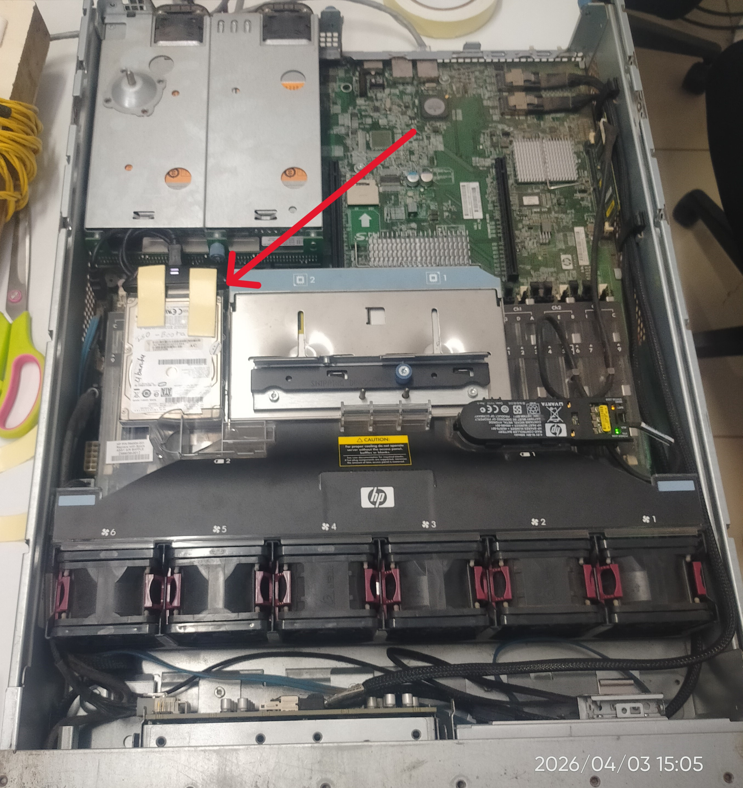

# 🔥 pfSense Firewall Setup (Homelab Project In Office environment)

## 📌 Overview

This project shows how to install and configure pfSense firewall on a physical server for learning and network security practice.

---

## 💿 Download pfSense

You can download pfSense CE from the official website:

👉 https://www.pfsense.org/download/

Steps:

1. Select Architecture: AMD64
2. Installer: USB Memstick Installer
3. Console: VGA
4. Download and create bootable USB using Rufus

---

## 🖥️ Hardware Used

* Server: Lenovo System x3250 M4
* CPU: Intel Xeon E3
* RAM: 4GB+
* Storage: HDD/SSD

---

## ⚙️ Installation Steps (Simple)

1. Create bootable USB using Rufus
2. Insert USB and boot server
3. Install pfSense on disk
4. Assign WAN and LAN interfaces
5. Open browser → http://192.168.1.1
6. Login:

   * Username: admin
   * Password: pfsense

---

## 🎯 Purpose of This Project

The purpose of using pfSense firewall in this project is:

* To secure network traffic
* To monitor and control incoming/outgoing connections
* To create a safe lab environment
* To use as a backup firewall system in case of network failure
* To learn real-world firewall configuration

---
## 🖥️ Server Used

## 🖥️ Server Used

<p align="center">
  
</p>

<p align="center">
  <em>Figure: Lenovo System x3250 M4 rack server used in this project</em>
</p>

## ⚠️ Problems Faced

### 1. Internal Hard Disk Not Detected

* The server was not detecting the internal HDD during installation

**Solution:**

* Connected the hard disk externally using a USB to SATA cable
* Installed pfSense successfully using external connection

---

### 2. Automatic Shutdown Issue

* Server was shutting down automatically sometimes

**Possible Reason:**

* Hardware issue (power supply or short circuit)

**Solution:**

* Checked power cable and connections
* Ensured proper power supply and cooling

---

### 3. PCI Error During Boot

* Error:

  ```
  failed to allocate initial prefetch window
  ```

**Impact:**

* Console output was broken

---

### 4. Broken Console Output

* Display was not clear during boot
* Hard to read system logs

---

### 5. UEFI / Legacy Boot Confusion

* BIOS did not clearly show boot mode options
* Difficult to switch between UEFI and Legacy

---

## ✅ Final Result

* pfSense installed successfully
* Web interface working
* Network connectivity working
* Firewall setup completed

---

## 🚀 Learning Outcome

* Learned firewall setup
* Understood server hardware issues
* Gained troubleshooting experience
* Learned networking basics (WAN, LAN, NAT)

---

## 👨‍💻 Author

Omkar Santosh Patil
